# NMDPRA Fleet Management System — Relational Database Design

## 1. Purpose and scope

This document defines the proposed enterprise relational model for the NMDPRA Fleet Management System before any Prisma models or migrations are created.

The design covers:

- Identity, role-based access control, and organizational structure
- Vehicles, drivers, documents, and operational status
- Vehicle requests, configurable approvals, allocations, and trips
- GPS devices and telemetry
- Fuel cards, vendors, and fuel transactions
- Maintenance plans and work orders
- Notifications, saved reports, audit history, and AI recommendations

Dashboard metrics and most reports should be calculated from operational records or database views. They are not separate transactional entities.

## 2. Design principles

- Use UUID primary keys for business entities.
- Store all timestamps as timezone-aware UTC values and display them in the user's locale.
- Use `numeric`, never floating point, for money, fuel quantity, distance, and geographic precision.
- Preserve operational and approval history; do not overwrite historical facts.
- Use restrictive foreign keys for transaction history and soft retirement for referenced master data.
- Separate a vehicle request from its approval, allocation, and actual trip.
- Treat roles as many-to-many assignments rather than one role column on a user.
- Keep telemetry append-only and partition it by observation time when volume requires it.
- Store files in object storage; persist only metadata and storage references in SQL Server.

## 3. Entity catalog

### 3.1 Organization and access control

| Entity           | Purpose                                                                         | Important attributes                                                                                                                   |
| ---------------- | ------------------------------------------------------------------------------- | -------------------------------------------------------------------------------------------------------------------------------------- |
| `Department`     | NMDPRA organizational unit or fleet-owning cost center.                         | `id`, `parentDepartmentId`, `code`, `name`, `status`, timestamps                                                                       |
| `User`           | Authenticated person using the platform.                                        | `id`, `employeeNumber`, `firstName`, `lastName`, `email`, `phone`, `passwordHash`, `departmentId`, `status`, `lastLoginAt`, timestamps |
| `Role`           | Named RBAC role such as Requester, Supervisor, Fleet Manager, or Administrator. | `id`, `code`, `name`, `description`, `isSystemRole`                                                                                    |
| `Permission`     | Atomic system capability.                                                       | `id`, `code`, `description`                                                                                                            |
| `UserRole`       | Temporal assignment of a role to a user, optionally scoped to a department.     | `userId`, `roleId`, `scopeDepartmentId`, `validFrom`, `validTo`, `assignedByUserId`                                                    |
| `RolePermission` | Grants a permission to a role.                                                  | `roleId`, `permissionId`                                                                                                               |

### 3.2 Fleet master data

| Entity                 | Purpose                                                               | Important attributes                                                                                                                                                                                             |
| ---------------------- | --------------------------------------------------------------------- | ---------------------------------------------------------------------------------------------------------------------------------------------------------------------------------------------------------------- |
| `VehicleCategory`      | Classification used for eligibility, reporting, and request matching. | `id`, `code`, `name`, `passengerCapacity`, `description`                                                                                                                                                         |
| `Vehicle`              | Fleet asset and its current operational snapshot.                     | `id`, `registrationNumber`, `vin`, `assetNumber`, `categoryId`, `departmentId`, `make`, `model`, `manufactureYear`, `fuelType`, `transmissionType`, `acquisitionDate`, `currentOdometerKm`, `status`, timestamps |
| `Driver`               | Driver-specific employee profile.                                     | `id`, `userId`, `employeeNumber`, `licenceNumber`, `licenceClass`, `licenceIssuedOn`, `licenceExpiresOn`, `status`, timestamps                                                                                   |
| `Document`             | Metadata for a stored compliance or operational document.             | `id`, `entityType`, `entityId`, `documentType`, `documentNumber`, `storageKey`, `issuedOn`, `expiresOn`, `status`, `uploadedByUserId`, timestamps                                                                |
| `VehicleStatusHistory` | Immutable record of every vehicle status transition.                  | `id`, `vehicleId`, `fromStatus`, `toStatus`, `reason`, `changedByUserId`, `changedAt`                                                                                                                            |

`Document` is a controlled polymorphic association. In implementation, database integrity must be enforced either with separate `VehicleDocument` and `DriverDocument` tables or with a trigger validating the `entityType/entityId` pair. Separate tables are preferred if strict foreign keys are required.

### 3.3 Requests, approvals, allocations, and trips

| Entity              | Purpose                                                                     | Important attributes                                                                                                                                                                                          |
| ------------------- | --------------------------------------------------------------------------- | ------------------------------------------------------------------------------------------------------------------------------------------------------------------------------------------------------------- |
| `VehicleRequest`    | Request for official transport; does not itself assign a vehicle or driver. | `id`, `requestNumber`, `requestedByUserId`, `departmentId`, `categoryId`, `purpose`, `origin`, `destination`, `requestedDepartureAt`, `requestedReturnAt`, `passengerCount`, `priority`, `status`, timestamps |
| `RequestPassenger`  | Named passenger associated with a request.                                  | `id`, `requestId`, `userId`, `fullName`, `phone`, `isPrimaryContact`                                                                                                                                          |
| `ApprovalWorkflow`  | Versioned approval process definition.                                      | `id`, `code`, `name`, `version`, `appliesTo`, `isActive`, timestamps                                                                                                                                          |
| `ApprovalStep`      | Ordered rule in a workflow definition.                                      | `id`, `workflowId`, `stepOrder`, `name`, `approverRoleId`, `approverDepartmentRule`, `minimumApprovals`, `isRequired`                                                                                         |
| `ApprovalInstance`  | Approval process started for one vehicle request.                           | `id`, `requestId`, `workflowId`, `status`, `currentStepOrder`, `startedAt`, `completedAt`                                                                                                                     |
| `ApprovalDecision`  | Immutable action by an approver at a workflow step.                         | `id`, `instanceId`, `stepId`, `approverUserId`, `decision`, `comment`, `decidedAt`                                                                                                                            |
| `VehicleAllocation` | Time-bound reservation of a vehicle and driver against an approved request. | `id`, `requestId`, `vehicleId`, `driverId`, `allocatedByUserId`, `scheduledStartAt`, `scheduledEndAt`, `status`, `releasedAt`, `releaseReason`, timestamps                                                    |
| `Trip`              | Actual execution of an allocation.                                          | `id`, `tripNumber`, `allocationId`, `actualStartAt`, `actualEndAt`, `startOdometerKm`, `endOdometerKm`, `origin`, `destination`, `status`, `startedByUserId`, `closedByUserId`, timestamps                    |
| `TripEvent`         | Immutable operational event during a trip.                                  | `id`, `tripId`, `eventType`, `occurredAt`, `latitude`, `longitude`, `notes`, `recordedByUserId`                                                                                                               |

### 3.4 GPS and telemetry

| Entity                    | Purpose                                                    | Important attributes                                                                                                                                                 |
| ------------------------- | ---------------------------------------------------------- | -------------------------------------------------------------------------------------------------------------------------------------------------------------------- |
| `GpsDevice`               | Physical telematics device and provider identity.          | `id`, `serialNumber`, `imei`, `provider`, `status`, `installedAt`, `retiredAt`                                                                                       |
| `VehicleDeviceAssignment` | Effective-dated installation of a GPS device in a vehicle. | `id`, `vehicleId`, `deviceId`, `installedAt`, `removedAt`, `installedByUserId`                                                                                       |
| `GpsPosition`             | Append-only location and movement observation.             | `id`, `deviceId`, `recordedAt`, `receivedAt`, `latitude`, `longitude`, `speedKph`, `headingDegrees`, `odometerKm`, `ignitionOn`, `accuracyMeters`, `providerEventId` |

### 3.5 Fuel management

| Entity               | Purpose                                                 | Important attributes                                                                                                                                                                                                               |
| -------------------- | ------------------------------------------------------- | ---------------------------------------------------------------------------------------------------------------------------------------------------------------------------------------------------------------------------------- |
| `FuelVendor`         | Approved fuel supplier or station operator.             | `id`, `code`, `name`, `taxNumber`, `status`, contact fields                                                                                                                                                                        |
| `FuelCard`           | Controlled payment instrument assigned over time.       | `id`, `maskedNumber`, `providerReference`, `status`, `expiresOn`, `dailyLimitAmount`, `monthlyLimitAmount`                                                                                                                         |
| `FuelCardAssignment` | Effective-dated assignment of a fuel card to a vehicle. | `id`, `fuelCardId`, `vehicleId`, `assignedAt`, `unassignedAt`, `assignedByUserId`                                                                                                                                                  |
| `FuelTransaction`    | Auditable fuel purchase or dispensing event.            | `id`, `transactionReference`, `vehicleId`, `driverId`, `tripId`, `fuelCardId`, `vendorId`, `occurredAt`, `fuelType`, `quantityLitres`, `unitPrice`, `totalAmount`, `odometerKm`, `receiptDocumentId`, `status`, `recordedByUserId` |

### 3.6 Maintenance

| Entity                 | Purpose                                                | Important attributes                                                                                                                                                                                                                               |
| ---------------------- | ------------------------------------------------------ | -------------------------------------------------------------------------------------------------------------------------------------------------------------------------------------------------------------------------------------------------- |
| `MaintenanceVendor`    | Approved workshop or parts/service provider.           | `id`, `code`, `name`, `taxNumber`, `status`, contact fields                                                                                                                                                                                        |
| `MaintenancePlan`      | Preventive maintenance rule for a category or vehicle. | `id`, `name`, `vehicleCategoryId`, `vehicleId`, `serviceType`, `intervalKm`, `intervalDays`, `isActive`                                                                                                                                            |
| `MaintenanceWorkOrder` | Planned or corrective maintenance job.                 | `id`, `workOrderNumber`, `vehicleId`, `planId`, `vendorId`, `serviceType`, `description`, `priority`, `status`, `openedAt`, `scheduledAt`, `startedAt`, `completedAt`, `odometerKm`, `estimatedCost`, `actualCost`, `approvedByUserId`, timestamps |
| `MaintenanceItem`      | Line item for labour, parts, or service performed.     | `id`, `workOrderId`, `itemType`, `description`, `quantity`, `unitCost`, `totalCost`                                                                                                                                                                |

### 3.7 Communication, reporting, intelligence, and governance

| Entity             | Purpose                                                          | Important attributes                                                                                                                                                                                                        |
| ------------------ | ---------------------------------------------------------------- | --------------------------------------------------------------------------------------------------------------------------------------------------------------------------------------------------------------------------- |
| `Notification`     | User-targeted in-app/email/SMS delivery record.                  | `id`, `userId`, `type`, `channel`, `subject`, `body`, `status`, `sentAt`, `readAt`, `relatedEntityType`, `relatedEntityId`, timestamps                                                                                      |
| `ReportDefinition` | Saved report configuration, not generated report data.           | `id`, `ownerUserId`, `name`, `reportType`, `filtersJson`, `scheduleCron`, `isShared`, timestamps                                                                                                                            |
| `AiRecommendation` | Versioned recommendation generated from traceable inputs.        | `id`, `recommendationType`, `subjectType`, `subjectId`, `modelName`, `modelVersion`, `inputSnapshotJson`, `recommendationJson`, `confidenceScore`, `status`, `generatedAt`, `reviewedByUserId`, `reviewedAt`, `reviewNotes` |
| `AuditLog`         | Append-only record of security-sensitive and business mutations. | `id`, `actorUserId`, `action`, `entityType`, `entityId`, `beforeJson`, `afterJson`, `ipAddress`, `userAgent`, `correlationId`, `occurredAt`                                                                                 |

## 4. Entity relationship diagram

```mermaid
erDiagram
    DEPARTMENT ||--o{ DEPARTMENT : "contains"
    DEPARTMENT ||--o{ USER : "employs"
    DEPARTMENT ||--o{ VEHICLE : "owns"
    USER ||--o{ USER_ROLE : "receives"
    ROLE ||--o{ USER_ROLE : "is assigned"
    DEPARTMENT o|--o{ USER_ROLE : "scopes"
    ROLE ||--o{ ROLE_PERMISSION : "grants"
    PERMISSION ||--o{ ROLE_PERMISSION : "is granted by"

    VEHICLE_CATEGORY ||--o{ VEHICLE : "classifies"
    USER o|--o| DRIVER : "has driver profile"
    VEHICLE ||--o{ VEHICLE_STATUS_HISTORY : "changes status"
    USER ||--o{ VEHICLE_STATUS_HISTORY : "records"

    USER ||--o{ VEHICLE_REQUEST : "submits"
    DEPARTMENT ||--o{ VEHICLE_REQUEST : "owns"
    VEHICLE_CATEGORY ||--o{ VEHICLE_REQUEST : "is requested"
    VEHICLE_REQUEST ||--o{ REQUEST_PASSENGER : "includes"
    USER o|--o{ REQUEST_PASSENGER : "may identify"

    APPROVAL_WORKFLOW ||--|{ APPROVAL_STEP : "defines"
    ROLE ||--o{ APPROVAL_STEP : "may approve"
    VEHICLE_REQUEST ||--o| APPROVAL_INSTANCE : "initiates"
    APPROVAL_WORKFLOW ||--o{ APPROVAL_INSTANCE : "governs"
    APPROVAL_INSTANCE ||--o{ APPROVAL_DECISION : "records"
    APPROVAL_STEP ||--o{ APPROVAL_DECISION : "receives"
    USER ||--o{ APPROVAL_DECISION : "makes"

    VEHICLE_REQUEST ||--o{ VEHICLE_ALLOCATION : "is fulfilled by"
    VEHICLE ||--o{ VEHICLE_ALLOCATION : "is reserved in"
    DRIVER ||--o{ VEHICLE_ALLOCATION : "is scheduled in"
    USER ||--o{ VEHICLE_ALLOCATION : "creates"
    VEHICLE_ALLOCATION ||--o| TRIP : "executes as"
    TRIP ||--o{ TRIP_EVENT : "contains"

    VEHICLE ||--o{ VEHICLE_DEVICE_ASSIGNMENT : "hosts"
    GPS_DEVICE ||--o{ VEHICLE_DEVICE_ASSIGNMENT : "is installed through"
    GPS_DEVICE ||--o{ GPS_POSITION : "reports"

    FUEL_CARD ||--o{ FUEL_CARD_ASSIGNMENT : "is assigned through"
    VEHICLE ||--o{ FUEL_CARD_ASSIGNMENT : "receives"
    VEHICLE ||--o{ FUEL_TRANSACTION : "consumes"
    DRIVER o|--o{ FUEL_TRANSACTION : "purchases"
    TRIP o|--o{ FUEL_TRANSACTION : "may incur"
    FUEL_CARD o|--o{ FUEL_TRANSACTION : "pays for"
    FUEL_VENDOR o|--o{ FUEL_TRANSACTION : "supplies"

    VEHICLE_CATEGORY o|--o{ MAINTENANCE_PLAN : "uses default"
    VEHICLE o|--o{ MAINTENANCE_PLAN : "uses override"
    VEHICLE ||--o{ MAINTENANCE_WORK_ORDER : "undergoes"
    MAINTENANCE_PLAN o|--o{ MAINTENANCE_WORK_ORDER : "triggers"
    MAINTENANCE_VENDOR o|--o{ MAINTENANCE_WORK_ORDER : "performs"
    MAINTENANCE_WORK_ORDER ||--o{ MAINTENANCE_ITEM : "contains"

    USER ||--o{ NOTIFICATION : "receives"
    USER ||--o{ REPORT_DEFINITION : "owns"
    USER o|--o{ AI_RECOMMENDATION : "reviews"
    USER o|--o{ AUDIT_LOG : "acts in"
```

## 5. Relationship and lifecycle rules

1. A department may have one parent department; cycles and self-parenting are prohibited.
2. A user belongs to one primary department and may hold multiple roles. Department-scoped role assignments are effective only during their validity window.
3. A driver profile may belong to one user, but not every user is a driver.
4. A vehicle request selects a required category, not a specific vehicle. A vehicle and driver are selected only during allocation.
5. A request must be approved before an active allocation can be created, except through an explicitly audited emergency override permission.
6. A request may have multiple allocations over time because an allocation can be cancelled or replaced, but no more than one allocation may be active for the same request at once.
7. An allocation may produce at most one trip. A trip cannot start until its allocation is active.
8. A vehicle, driver, GPS device, or fuel card cannot have overlapping active assignments for the same time interval.
9. A trip's vehicle and driver are inherited from the allocation and must not be duplicated as independently editable foreign keys.
10. Approval definitions are versioned. Running and completed instances retain the workflow version with which they started.
11. Approval decisions and audit logs are append-only. Corrections are represented by a new event, not an update or delete.
12. GPS positions belong to a device. The device-to-vehicle assignment effective at `recordedAt` determines the vehicle.
13. Vehicle odometer values must be monotonic unless an authorized correction is recorded and audited.
14. Completing a maintenance work order may transition a vehicle back to available; opening safety-critical work may transition it to maintenance or out of service.
15. AI recommendations are advisory. They never directly approve a request, allocate a vehicle, or mutate operational records.

## 6. Keys, uniqueness, and check constraints

### Global conventions

- Every mutable entity has `createdAt`, `updatedAt`, and where appropriate `createdByUserId` and `updatedByUserId`.
- Master data uses a controlled status such as `ACTIVE`, `INACTIVE`, or `RETIRED`; transaction entities use explicit lifecycle states.
- Case-insensitive business identifiers should use SQL Server case-insensitive collation or computed normalized columns where stricter behavior is needed.
- Monetary values use one configured currency per transaction or include a required ISO 4217 `currencyCode`.

### Required uniqueness

- `Department.code`
- `User.employeeNumber` and case-insensitive `User.email`
- `Role.code` and `Permission.code`
- `UserRole(userId, roleId, scopeDepartmentId, validFrom)`
- `RolePermission(roleId, permissionId)`
- `Vehicle.registrationNumber`, `Vehicle.vin`, and `Vehicle.assetNumber`
- `Driver.userId`, `Driver.employeeNumber`, and `Driver.licenceNumber`
- `VehicleRequest.requestNumber`
- `ApprovalWorkflow(code, version)`
- `ApprovalStep(workflowId, stepOrder)`
- One `ApprovalInstance` per request unless workflow restart history is required; if restarts are allowed, add `attemptNumber` and use `(requestId, attemptNumber)`.
- One `ApprovalDecision(instanceId, stepId, approverUserId)` unless a formal reconsideration event is added.
- `Trip.tripNumber` and `Trip.allocationId`
- `GpsDevice.serialNumber` and `GpsDevice.imei`
- `GpsPosition(deviceId, providerEventId)` when the provider supplies a stable event identifier
- `FuelVendor.code`, `FuelCard.providerReference`, and `FuelTransaction.transactionReference`
- `MaintenanceVendor.code` and `MaintenanceWorkOrder.workOrderNumber`

### Required checks

- `requestedReturnAt > requestedDepartureAt`
- `scheduledEndAt > scheduledStartAt`
- `actualEndAt >= actualStartAt`
- `endOdometerKm >= startOdometerKm`
- `passengerCount > 0` and does not exceed the allocated vehicle's capacity
- `manufactureYear` is within an operationally sensible range and not later than the current year plus one
- Latitude is between `-90` and `90`; longitude is between `-180` and `180`
- Heading is between `0` and less than `360`
- Distance, quantity, price, cost, and odometer values are non-negative
- `FuelTransaction.totalAmount` equals `quantityLitres × unitPrice` within the approved currency rounding tolerance, or is explicitly marked as adjusted
- `MaintenanceItem.totalCost` equals `quantity × unitCost` within currency rounding tolerance
- Licence and compliance documents must not be expired when a driver or vehicle is assigned, unless an auditable override exists
- `confidenceScore` is between `0` and `1`
- Exactly one of `MaintenancePlan.vehicleCategoryId` and `MaintenancePlan.vehicleId` is populated
- A request passenger has either `userId` or `fullName`; both may be present, but at least one is required

### Exclusion and partial unique constraints

Application/service-layer checks or SQL Server constraints should prevent overlapping time ranges for:

- Active vehicle allocations by `vehicleId`
- Active driver allocations by `driverId`
- Active GPS device assignments by `deviceId` and active device assignments by `vehicleId`
- Active fuel-card assignments by `fuelCardId`

Partial unique indexes should enforce only one current assignment or active record where an end timestamp is null.

## 7. Referential actions

- Use `ON DELETE RESTRICT` for users, departments, vehicles, drivers, requests, allocations, trips, fuel transactions, work orders, approvals, and audit-linked records.
- Use `ON DELETE CASCADE` only for dependent configuration rows that have no independent business history, such as `RolePermission` and draft-only workflow steps.
- Use `ON DELETE SET NULL` for optional historical actors only if user deletion is legally required; otherwise deactivate users and retain the reference.
- Never cascade-delete telemetry, approval decisions, financial transactions, or audit logs from a master-data deletion.

## 8. Status domains

Status values should be implemented as controlled application constants, SQL Server check constraints, or reference tables after lifecycle review.

- User: `INVITED`, `ACTIVE`, `SUSPENDED`, `DEACTIVATED`
- Vehicle: `AVAILABLE`, `RESERVED`, `IN_USE`, `MAINTENANCE`, `OUT_OF_SERVICE`, `RETIRED`
- Driver: `AVAILABLE`, `ASSIGNED`, `ON_LEAVE`, `SUSPENDED`, `INACTIVE`
- Request: `DRAFT`, `SUBMITTED`, `IN_APPROVAL`, `APPROVED`, `REJECTED`, `ALLOCATED`, `IN_PROGRESS`, `COMPLETED`, `CANCELLED`
- Approval: `PENDING`, `APPROVED`, `REJECTED`, `CANCELLED`, `EXPIRED`
- Allocation: `PLANNED`, `ACTIVE`, `RELEASED`, `CANCELLED`
- Trip: `SCHEDULED`, `IN_PROGRESS`, `COMPLETED`, `ABORTED`, `CANCELLED`
- Work order: `OPEN`, `APPROVED`, `SCHEDULED`, `IN_PROGRESS`, `COMPLETED`, `CANCELLED`
- AI recommendation: `PENDING_REVIEW`, `ACCEPTED`, `REJECTED`, `EXPIRED`

Transitions must be validated in the service layer and recorded in audit history. Database checks ensure valid values but do not replace workflow authorization.

## 9. Indexing and scale considerations

- Index every foreign key used for joins.
- Add composite indexes for operational queues, including `(status, requestedDepartureAt)`, `(vehicleId, scheduledStartAt, scheduledEndAt)`, and `(driverId, scheduledStartAt, scheduledEndAt)`.
- Index expiring licences/documents by `(status, expiresOn)`.
- Index fuel and maintenance facts by `(vehicleId, occurredAt)` and `(vehicleId, completedAt)`.
- Partition `GpsPosition` by month on `recordedAt`; index `(deviceId, recordedAt DESC)` within partitions.
- Consider PostGIS and a GiST index for geofencing or route-spatial queries. Plain latitude/longitude columns are sufficient until spatial features are confirmed.
- Partition `AuditLog` by time when retention volume warrants it.
- Use materialized views for expensive dashboard aggregates; refresh them asynchronously rather than duplicating transactional facts.

## 10. Security, audit, and retention

- Store password hashes only; authentication secrets and tokens must not be stored in plaintext.
- Encrypt sensitive personal and provider data at rest where required by NMDPRA policy.
- Mask fuel-card numbers and store only tokenized provider references.
- Log approvals, overrides, allocations, trip closure, fuel changes, maintenance approvals, role assignments, and exports.
- Restrict telemetry and personal data by role and department scope.
- Define retention periods for GPS data, audit logs, financial records, documents, notifications, and AI input snapshots before implementation.
- Avoid personal data in free-text fields and AI input snapshots unless explicitly required and governed.

## 11. Decisions required before Prisma modeling

The following requirements must be confirmed with NMDPRA stakeholders before translating this design into Prisma models:

1. Whether departments form a hierarchy and whether access inherits down that hierarchy.
2. Exact approval routing rules, parallel approvals, delegation, escalation, and emergency overrides.
3. Whether external passengers and non-user drivers are allowed.
4. Whether one request can result in multiple simultaneous vehicles or trips. If yes, introduce a request-leg or request-allocation-group model.
5. Whether GPS/geofencing requires PostGIS.
6. Fuel-card provider integration, currency rules, and reconciliation requirements.
7. Maintenance inventory, spare-parts stock, purchase orders, and invoice requirements.
8. Document types, compliance rules, and retention periods.
9. Required integrations with HR, finance, identity providers, GPS vendors, and government systems.
10. Data residency, privacy classification, audit retention, and disaster-recovery requirements.

No Prisma models should be created until these decisions and the lifecycle states are reviewed and approved.
